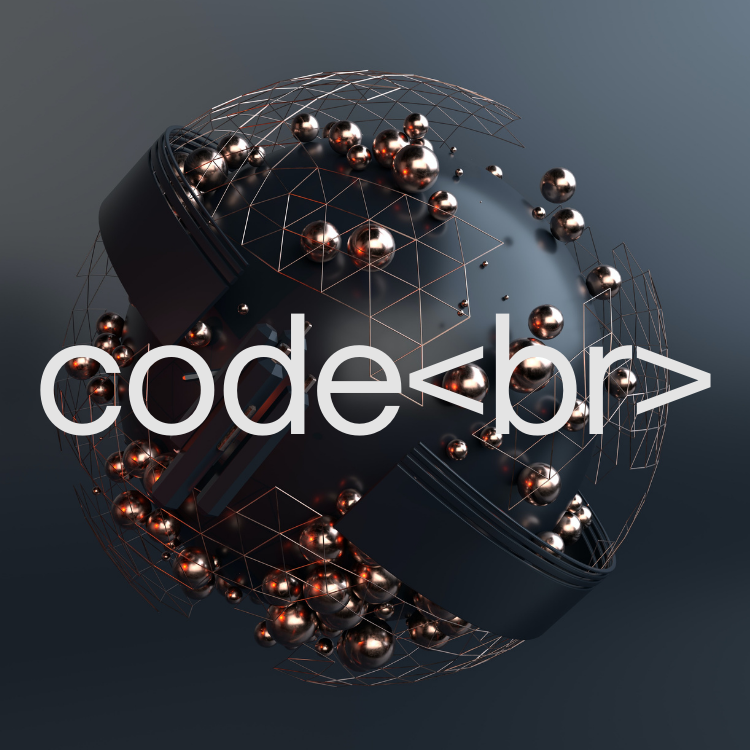
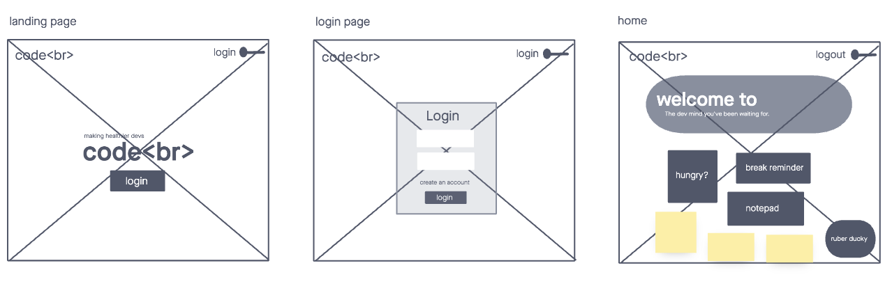

<div align="center">

</div>
<h1 align="center">The dev mind you've been waiting for...</h1> 

## Authors: Marquesa Asmussen, Christopher Burk, Sarah Creager, Roop Hayer, Harvey Lucas

## Version: 1.0.0

## About

`code<br>` is an application dashboard for developers that provides break reminders, food suggestions, a notepad for thoughts/insights/reminders, and a rubber ducky programming companion. This app is integrated with basic and bearer auth login for additional security and includes an extensive test suite.

## Our Mission

We are on a mission to make healthier devs so they can build a better world. Our application helps you find balance and a healthy headspace as a developer.

## Problem Domain

You just need 20 more minutes to solve this bug...okay maybe 30 more minutes. You glance up at the clock in frustration. 2 hours have passed. Then you realize you haven't eaten lunch...

If you're a developer, you can probably relate to this. Forgetting to take breaks, sitting for hours on end, getting frustrated when you've been stuck on the same problem for hours on end. We've all been there. So our team of developers at `code<br` set out to change that and to help prevent developer burnout. The overall emphasis of our application is to help you find balance and create a healthy headspace. When you're feeling drained, come to `code<br>` and reboot.

## Project Overview

| Title      | Languages/Frameworks/Libraries/Tools |
| ----------- | ----------- |
| Frontend | React, Netlify, Material UI, Jest, MSW, Axios, Jsonwebtoken, SCSS|
| Backend | Node.js, Express, Mongoose, Heroku, PostgreSQL, Sqlite3, Sequelize, Jest, Supertest, Jsonwebtoken, Axios, Base-64, Bcrypt |
| Integrations | Travel Advisor API |

## Installation

1. `npm install`  
    * @emotion/react
    * @emotion/styled
    * @mui/icons-material
    * @mui/lab
    * @mui/material
    * @mui/styled-engine-sc
    * @testing-library/jest-dom
    * @testing-library/react
    * @testing-library/user-event
    * axios
    * buffer
    * date-fns
    * jsonwebtoken
    * msw
    * react
    * react-cookies
    * react-dom
    * react-error-overlay
    * react-if
    * react-router-dom
    * react-scripts
    * sass
    * stream
    * util
    * web-vitals

2. `npm start`

*sample .env*
``` 
REACT_APP_SECRET=placeYourSecretHere

REACT_APP_URL=placeHerokuURLHere
```

## User Stories

### Login/Logout Feature

As a user I want to be able to login and logout of my account

Feature Tasks:

User can press login to access account
User can press signup to create a new account

Acceptance:

When the user signs up, they can create a new account
When the user signs in, they can access the home page

### Change color theme

As a user, I want to change colors for the theme of the app

Feature Tasks:
Add toggle switch to change colors from dark to light and vice-versa.

Acceptance:
When user clicks on toggle switch, it should change theme.

m### Order food

As a user, I want to restore my energy by ordering a meal or snack.

Feature Tasks:

Add textfield for entering a search location (zip code).
Add component/ route to display Yelp API restaurant results based on location.

Acceptance Tests:

When user enters zip code, restaurant results should display.

### Timer

As a user, I want to have timer for break.

Feature Tasks:

Add timer tab that can be changed to desired minutes and user can start and stop.

Acceptance Tests:

User should be able to change time intervals.
User should be able to start and stop the time.

### Rubber Duck

As a user, I want to have a one way conversation with Rubber Duck.

Feature Tasks:

Add ruby duck animation.

Acceptance Tests:

User should be able to click on Rubber Duck rendering it to the web page.

## Wireframe

*wireframe 1*


*wireframe 2*


## Software Requirements

Check out our [software requirements](requirements.md) doc!

## Resources and Contributions

### Sites

* [light background](https://unsplash.com/photos/uuCjYxJVf4o)
* [dark background](https://unsplash.com/photos/DjjaZybYx4I)
* [dark homepage banner](https://unsplash.com/photos/MrWOCGKFVDg)
* [light homepage banner](https://unsplash.com/photos/xB2XP29gn10)
* [Unsplash](https://unsplash.com/)
* [GitHub Projects](https://docs.github.com/en/issues/trying-out-the-new-projects-experience/about-projects)
* [Stack Overflow](stackoverflow.com)
* [MDN Docs](https://developer.mozilla.org/en-US/)
* [W3 Schools](https://www.w3schools.com/)
* [Node JS Docs](https://nodejs.org/en/docs/)
* [ReactJS](https://reactjs.org/)
* [Material UI docs](https://mui.com/getting-started/usage/)
* [Travel Advisor API Documentation](https://rapidapi.com/apidojo/api/travel-advisor)
* [Medium](https://medium.com/)

### Advisors

- _[Jacob Knaack ](https://www.linkedin.com/in/jacobknaack/)_
- _[Audrey Patterson](https://www.linkedin.com/in/audrey-patterson31/)_
- _[Alexander Williams](https://www.linkedin.com/in/alexander-williams2311/)_
- _[Marie Marcos ](https://www.linkedin.com/in/marie-marcos/)_

- And all the other TAs who helped us along the way

## Deployed Site Links

[Netlify](https://codebr.netlify.app/)  
[Heroku](https://code-break-server.herokuapp.com)

## Future Implementations

* Integrate break reminder into React Native app so break reminder can notify user's phone if they step away from desktop
* Create a mental reset component that leads user through a quick 30-60 second breathing exercise
* Provide user song suggestions for coding workflow based on mood
